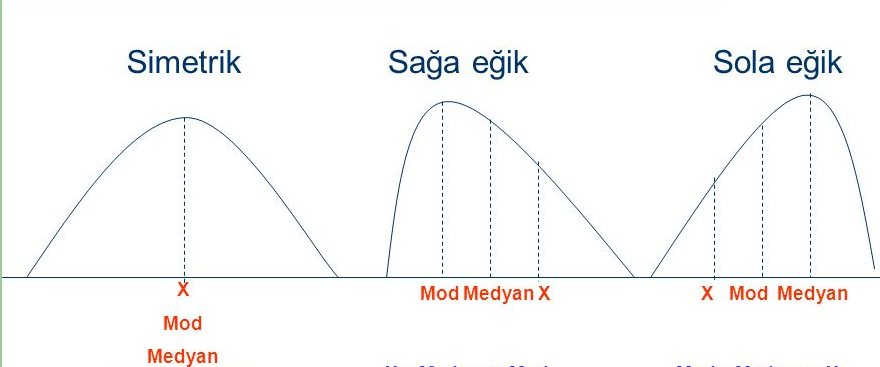
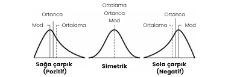
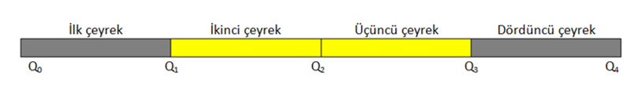
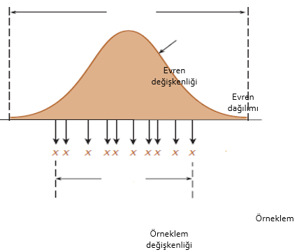

## İçerik

-   Frekans Tablosu Oluşturma
-   Merkezi Eğitim Ölçüleri
    - Mod
    - Medyan 
    - Aritmetik Ortalama
-   Merkezi Dağılım Ölçüleri
    - Ranj    
    - Çeyrek Sapma
    - Standart Sapma/Varyans
    
## Frekans Tablosu Oluşturma {.smaller}

::: columns
::: {.column width="60%"}
50 Öğrencinin 100 Üzerinden Aldığı Puanlar

```{r echo=FALSE}
library(tidyr)
library(DT)
Frekans <- readxl::read_excel("data/frekans.xlsx")
datatable(Frekans,rownames = FALSE, options = list(
  pageLength = 5
))

```
:::

::: {.column width="40%"}
-   Testin uygulanması sonucu öğrencilerden elde edilen puanlar, üzerlerinde hiç bir düzenleme yapılmadan, bazı işlemler uygulanmadan bir puan yığını olmanın dışında bize hiç bir bilgi sunmaz.
:::
:::

## Frekans Tablosu Oluşturma {.smaller}

::: columns
::: {.column width="60%"}
50 Öğrencinin 100 Üzerinden Aldığı Puanlar

```{r echo=FALSE}
library(tidyr)
library(DT)
Frekans <- readxl::read_excel("data/frekans.xlsx")
datatable(Frekans,rownames=FALSE,
          extensions = 'Scroller', options = list(
  deferRender = TRUE,
  scrollY = 550,
  scroller = TRUE
))

```
:::

::: {.column width="40%"}
-   Tabloda öğrencilerin sınavdan aldıkları puanlar karışık bir şekilde verilmiştir. Bu tabloya bakarak öğrencilere ilişkin bilgide bulunmak, sınıfın başarı düzeyi vb. hakkında yorum yapmak oldukça zordur!!!
:::
:::

## Frekans Tablosu Oluşturma

-   Öğrenci puanları en düşük puandan en yüksek puana doğru düzenlenebilir.

-   Hatta puanların sıraya dizilmesiyle birlikte her puanın kaç öğrenci tarafından alındığını gösteren frekans sütunu da oluşturulabilir.

-   Ayrıca her bir puanın sahip olduğu frekans ile önceki frekansların toplanmasıyla "tf" ile gösterilen "toplam frekans" (yığılmalı frekans)" sütunu da oluşturulabilir.

## Frekans Tablosu Oluşturma {.smaller}

```{r}
Frekans_1 <- Frekans %>% dplyr::count(PUAN)
datatable(Frekans_1,rownames = FALSE,
  extensions = 'Scroller', options = list(
  deferRender = TRUE,
  scrollY = 550,
  scroller = TRUE
))
```

## Frekans Tablosu Oluşturma {.smaller}

::: columns
::: {.column width="50%"}
```{r}
library(dplyr)
Frekans_2 <- Frekans_1 %>% mutate(tf = cumsum(n))
datatable(Frekans_2,rownames = FALSE,
  extensions = 'Scroller', options = list(
  deferRender = TRUE,
  scrollY = 550,
  scroller = TRUE
))
```
:::

::: {.column width="50%"}
-   **Toplam frekans**, her bir puandan önce kaç tane puan olduğunu ve her bir puanın kaçıncı puan olduğunu da görebilmemizi sağlayan bir değerdir.

-   Örneğin; 23 puanı 3. sırada yer alır ve 23'ten önce iki puan bulunmaktadır;

-   11., 12., 13. ve 14. puanlar 39'tur ve 39'dan önce 10 puan daha bulunmaktadır vb.
:::
:::

# MERKEZİ EĞİLİM (YIĞILMA) ÖLÇÜLERİ

::: columns
::: {.column width="40%"}

<br>
<br>
-   Mod (tepe değer)
<br>
<br>
-   Medyan (ortanca)
<br>
<br>
-   Aritmetik ortalama
<br>
<br>
:::

::: {.column width="60%"}
<br>
<br>
<br>
{width=250%}

```{r, echo=FALSE, out.width="250%",}
# 
```

:::
:::

## Mod (tepe değer) {.smaller}


:::: {.columns} 

::: {.column width="40%"}
-   Puanlar içinde en çok tekrarlanan puandır. Frekansı en yüksek puandır.
```{r echo=FALSE}
library(ggplot2)
ggplot(data=Frekans,aes(x=PUAN)) +
  geom_bar()
```
:::

::: {.column width="60%"}
```{r echo=FALSE}
datatable(Frekans_2,rownames = FALSE,
  extensions = 'Scroller', options = list(
  deferRender = TRUE,
  scrollY = 550,
  scroller = TRUE))
```
:::
::::


## Medyan (ortanca) {.smaller}


:::: {.columns} 

::: {.column width="40%"}
-   Sıralanmış verilerin tam ortasında yer alan puandır.

-   Medyanın hesaplanması için öncelikle 50 puanın tam ortasında yer alan puanın kaçıncı puan olduğu belirlenmelidir: 50 puanı tam iki yarıya ayıran puanlar 25. ve 26. puanlarıdır. Toplamalı frekans sütununa bakıldığında bu puanların işaretlenmiş grupta bulundukları görülmektedir.
:::

::: {.column width="60%"}
```{r echo=FALSE}
datatable(Frekans_2,rownames = FALSE,
  extensions = 'Scroller', options = list(
  deferRender = TRUE,
  scrollY = 550,
  scroller = TRUE))
```
:::
::::

## Aritmetik ortalama

-   Puanların toplamının puan sayısına (öğrenci sayısına) bölünmesiyle elde edilen değerdir. Kısaca "ortalama" olarak da bilinir.


```{r, include=FALSE}

library(knitr)
library(tidyr)
library(magrittr)
library(dplyr)

library(ggplot2)
set.seed(10004)
ARASINAV <- rep(c(50,60,70,80,90),c(2,6,5,4,3))
FINAL <- rep(c(40,50,60,70,80,90,100),c(2,4,3,3,2,3,3))
PUAN <- tibble::tibble(ID= paste("I",(1:20),sep=""), ARASINAV,FINAL)
PUAN <- reshape2::melt(PUAN, id.vars = c("ID"))
PUAN_table <- PUAN %>% group_by(variable,value) %>%   summarise(n = n())
SINAV <- PUAN_table$variable
PUAN <- PUAN_table$value
FREKANS <- PUAN_table$n

PUAN_table <- tibble::tibble(SINAV,PUAN,FREKANS)
summary(PUAN_table)
```

## Aritmetik ortalama


```{r}
df <- data.frame(ID= paste("I",(1:20),sep=""), ARASINAV,FINAL)
 DT::datatable(df,rownames = FALSE,
               extensions = 'Scroller', options = list(
  deferRender = TRUE,
  scrollY = 550,
  scroller = TRUE
))
```

## Aritmetik ortalama {.smaller}

- **ARASINAV puanları** 

$\frac{50 + 50 + 60 + 60 + 60 + 60 + 60 + 60 + 70 + 70 + 70 + 70 + 70 + 80 + 80 + 80 + 80 + 90 + 90 + 90}{20} = 70$

-   **FINAL puanları**

$\frac{40 + 40 + 50 + 50 + 50 + 50 + 60 + 60 + 60 + 70 + 70 + 70 + 80 + 80 + 90 + 90 + 90 + 100 100 + 100}{20} = 70$


```{r echo=FALSE, message=FALSE, warning=FALSE, paged.print=TRUE}
ggplot2::ggplot(data = PUAN_table, aes(x = as.factor(PUAN) , y =FREKANS)) +
  facet_grid(SINAV~.) +
  geom_bar(stat="identity", fill="steelblue")+
  theme_minimal() +
  labs(x = "PUAN")

```


## Aritmetik ortalama{.smaller}


:::: {.columns}
::: {.column width="50%"}
- Ara Sınav Frekans Tablosu 

| Puan | Frekans |
|------|---------|
| 50   | 2       |
| 60   | 6       |
| 70   | 5       |
| 80   | 4       |
| 90   | 3       |
<br>
<br>
$\frac{50*2 + 60*6 + 70*5 + 80*4 + 90*3}{20} = 70$
:::

::: {.column width="50%"}
- Final  Frekans Tablosu 

| Puan | Frekans |
|------|---------|
| 40   | 2       |
| 50   | 4       |
| 60   | 3       |
| 70   | 3       |
| 80   | 2       |
| 90   | 3       |
| 100  | 3       |
<br>
<br>
$\frac{40*2 + 50*4 + 60*3 + 70*3 + 80*2 + 90*3 + 100*3}{20} = 70$
:::
::::


## Aritmetik ortalama


| İstatistik  | ARASINAV   | FINAL    |
|---|---|---|
| Minumum | 50 |40 |
| 1.çeyrek | 60 |50 |
| Ortanca | 70 |70 |
| Ortalama | 70 |70 |
| 3.çeyrek  | 80 |90 |
| Maksimum | 90 |100 |


# Dağılım Ölçüleri

-   Ranj

-   Çeyrek Sapma

-   Standart Sapma/Varyans


# Dağılım Ölçüleri {.smaller}

:::: {.columns}

::: {.column width="40%"}
-    İngilizce dersinde bir grup öğrenciye uygulanan arasınavdan alttaki grafik ise aynı gruba uygulanan finalden alınan puanları göstermektedir.

-   her iki sınavdan alınan puanların aritmetik ortalaması eşit olup 70´dir.

-   İki sınavdan alınan puanların **ortalaması birbirine eşit olmasına rağmen puanların dağılımı birbirinden oldukça farklıdır.**

-   Öğrencilerin puanları arasındaki fark finalde arasınava göre daha fazladır.
:::

::: {.column width="60%"}
```{r echo=FALSE, message=FALSE, warning=FALSE, paged.print=TRUE}
ggplot2::ggplot(data = PUAN_table, aes(x = as.factor(PUAN) , y =FREKANS)) +
  facet_grid(SINAV~.) +
  geom_bar(stat="identity", fill="steelblue")+
  theme_minimal() +
  labs(x = "PUAN")
```

:::

::::


## Ranj (Dizi Genişliği) {.smaller}

-   Puanların hangi aralıkta değiştiğini gösteren en basit merkezi dağılım ölçüsüdür. Bir başka deyişle, en yüksek puan ile en düşük puan arasındaki farktır.

```{r eval=FALSE, message=FALSE, warning=FALSE, include=FALSE, paged.print=TRUE}

load("data/puan.Rdata")
tbl <- table(puan)[10:15]
tibble( Puan = as.numeric(names(tbl)), Frekans=tbl, tf=cumsum(tbl),
Oran=round(prop.table(tbl),2)) %>%   kable(digits = 3, format="pandoc", caption="Frekans Tablosu")
```

| Puan | Frekans | tf  | Oran |
|------|---------|-----|------|
| 39   | 3       | 3   | 0.14 |
| 43   | 2       | 5   | 0.09 |
| 45   | 4       | 9   | 0.18 |
| 49   | 4       | 13  | 0.18 |
| 53   | 7       | 20  | 0.32 |
| 55   | 2       | 22  | 0.09 |


## Ranj (Dizi Genişliği)

```{r echo=FALSE, message=FALSE, warning=FALSE, paged.print=TRUE}

DERS_1 <- sample(1:20,30,replace = T)

DERS_2 <- c(min(DERS_1),sample(13:16,28,replace = T),max(DERS_1))

PUAN_DERS <- tibble::tibble(ID= paste("I",(1:30),sep=""), DERS_1,DERS_2)

PUAN_DERS <- reshape2::melt(PUAN_DERS, id.vars = c("ID"))

PUAN_DERS <- PUAN_DERS %>% group_by(variable,value) %>%   summarise(n = n())

SINAV <- PUAN_DERS$variable

PUAN <- PUAN_DERS$value

FREKANS <- PUAN_DERS$n

PUAN_DERS <- tibble::tibble(SINAV,PUAN,FREKANS)

```

```{r echo=FALSE, fig.height=3, fig.width=6, message=FALSE, warning=FALSE, paged.print=TRUE}

ggplot2::ggplot(data = PUAN_DERS, aes(x = as.factor(PUAN) , y =FREKANS)) +

  facet_grid(SINAV~.) +

  geom_bar(stat="identity", fill="steelblue")+

  theme_minimal() +

  labs(x = "PUAN")

```


## Ranj (Dizi Genişliği)

- Ranj tamamen **iki uç değer kullanılarak ve dağılımdaki diğer puanlar göz ardı edilerek** hesaplanan bir değişim ölçüsü olduğundan yeterince hassas ve kullanışlı değildir.

- Bir dağılımdaki uç değerlerin diğer puanlardan kopuk olması, puanların yayılımı hakkında **yanıltıcı bilgi verir.**

-  iki grafikteki puan dağılımlarının ranjı 18-1=17 olup puanların 17 puanlık bir aralıkta dağıldığını ifade eder. Ancak **birinci grubun daha heterojen, ikinci grubunsa daha homojen bir dağılım** gösterdiği gözlenmektedir

- Ranj, gruptaki puanların birbirine ne kadar yakın veya uzak olduğu ile ilgili bir bilgi vermemektedir.

---

## Çeyrek Sapma

- Puanların değişkenliğinin bir ölçüsü olan ranjın uç değerlerden etkilenmesi kısıtlılığını gideren bir ölçüdür. Çeyrek sapma, %75. puan ile %25. puan arasındaki farkın yarısı hesaplanarak elde edilir.



## Standart sapma / Varyans 

- En çok tercih edilen ve en yaygın kullanılan merkezi dağılım ölçüsüdür. 

- Puanların aritmetik ortalamadan farklılıklarının (uzaklıklarının) standart değerini verir. 

- Puanların farklılığı arttıkça standart sapma değeri artar, puanların farklılığı azaldıkça (benzerliği arttıkça) standart sapma değeri azalır. 


## **Standart sapma**


-   Standart sapma dağılımın ortalamasını referans noktası olarak kullanır ve her bir puan ve ortalama arasındaki uzaklığı ele alarak değişkenliği ölçer.

-   Böylece puanların genel olarak ortalamaya ne kadar yakın veya ortalamadan ne kadar uzak olup olmadığını belirler. Diğer bir ifadeyle puanların bir arada toplanıp toplanmadığını veya yayılıp yayılmadığını belirtir.

-   Özetle standart sapma ortalamadan ortalama uzaklığı tahmin eder.


## **Standart sapma / Varyans**

```{r echo=FALSE, message=FALSE, warning=FALSE, paged.print=TRUE}
d1 <- c(5,5,5,5,5)
d2 <- c(4,4,5,6,6)
d3 <- c(3,4,5,6,7)


d <- tibble::tibble(ID= paste("I",(1:5),sep=""), d1,d2,d3)
d <- reshape2::melt(d, id.vars = c("ID"))
d <- d %>% group_by(variable,value) %>%   summarise(n = n())
SINAV <- d$variable
PUAN <- d$value
FREKANS <- d$n

d <- tibble::tibble(SINAV,PUAN,FREKANS)
```

```{r fig.height=2, fig.width=4,echo=FALSE, message=FALSE, warning=FALSE, paged.print=TRUE}
ggplot2::ggplot(data = d, aes(x = as.factor(PUAN) , y =FREKANS)) +
  facet_grid(SINAV~.) +
  geom_bar(stat="identity", fill="steelblue")+
  theme_minimal() + 
  labs(x = "PUAN")

```


## **Standart sapma / Varyans**

-   Standart sapma, sapma puanı kavramına dayanır.

-   Bir grupta X ham puanına sahip her bir birey için sapma puanı, x, aşağıdaki şekilde tanımlanabilir:

-   Böylece bir sapma puanı, her bir bireyin puanı ve grup ortalaması arasındaki uzaklıktır.


## **Standart sapma / Varyans**

| $x_{i}$     | $x_{i}$     | $x_{i}^2$ |
|:-------:|:------------------:|:------------------------:|
| 8     | 8-3 =5           | 25                     |
| 1     | 1-3=-2           | 4                      |
| 3     | 3-3=0            | 0                      |
| 0     | 0-3=-3           | 9                      |
|       | = 5 - 2 +0 -3 =0 | =25 + 4 +0 +9 = 38 / 4 |

Ortalama dağılımın denge noktası olduğundan, ortalamanın üstündeki uzaklıkların toplamı, ortalamanın altındaki uzaklıkların toplamına eşittir. Bu nedenle sapma puanların toplamı HER ZAMAN sıfıra eşittir.


## **Standart sapma / Varyans**

-   Sapma puanların karesinin alınması işlemi, sadece artı ve eksi işaretlerden kurtulmaya yol açmaz, aynı zamanda kare uzaklıklara dayanan değişim ölçüsünün elde edilmesine neden olur.

-   Ancak varyans bazı sonuç çıkarmaya dayalı istatistiksel yöntemlerde kullanışlı olsa da, kare uzaklık kavramı anlaşılması kolay bir betimleyici ölçü değildir.

-   Varyansın kare kökünün alınmasıyla elde edilen standart sapma kavramsal olarak ortalamadan olan ortalama uzaklığın ölçüsünü sağlar ve ile gösterilir.


## **Standart sapma / Varyans**

|                                |                                   |
|--------------------------------|-----------------------------------|
| $$\sigma^2 = \frac{\sum(X_i -\mu)}{N}$$ | $$S^2 = \frac{\sum(X_i -\overline{X})}{N-1}$$ |


- Örneklemler evrenlerinden daha az değişkenlik gösterme eğilimindedir. Bir örneklemin evrenine göre daha az değişken olması eğilimi örneklem değişkenliğinin evren değişkenliğinin yanlı kestirimini vermesi anlamına gelmektedir. Bu yanlılık evren değerinin daha düşük kestirilmesi yönündedir.


---
## **Standart sapma / Varyans** {.smaller}




- Yetişkinlerin boy uzunlukları evreni normal bir dağılım gösterir. Bu evrenden bir örneklem seçilirse, uzunlukları ortalamaya yakın bireylerin örneklemde yer alma şansı daha yüksektir. Sonuç olarak örneklemdeki puanlar evrendeki puanlardan daha az yayılım göstereceklerdir. 