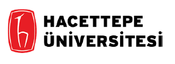

`r fontawesome::fa(name = "link")`: Kubra Atalay Kabasakal

```{r echo = FALSE, out.width ="15%"}


```
- Eğitim Fakültesi, Öğretim Üyesi [Öğretim Üyesi](https://avesis.hacettepe.edu.tr/katalay)

<br>


## Günün Planı

1.  09:30 -  11:00 -  [Madde İstatistikleri](01.html)
-   Test Geliştirme Aşamaları
-   Madde İstatistikleri
    -   Madde Güçlüğü
    -   Madde Ayırtediciliği
    -   Madde Değişkenliği (standart sapma/varyans)
    -   Madde Güvenirliği
    -   Çeldirici Analizi
-   Madde Seçimi

2.  11:15 -  12:45 -  [Madde Analizi Örnekleri](ORNEKSORULAR.pdf)

4.  14:00 - 15:30  -  [Test İstatistikleri](02.html)
-   Frekans Tablosu Oluşturma
-   Merkezi Eğitim Ölçüleri
    - Mod
    - Medyan 
    - Aritmetik Ortalama
-   Merkezi Dağılım Ölçüleri
    - Ranj    
    - Çeyrek Sapma
    - Standart Sapma/Varyans
    